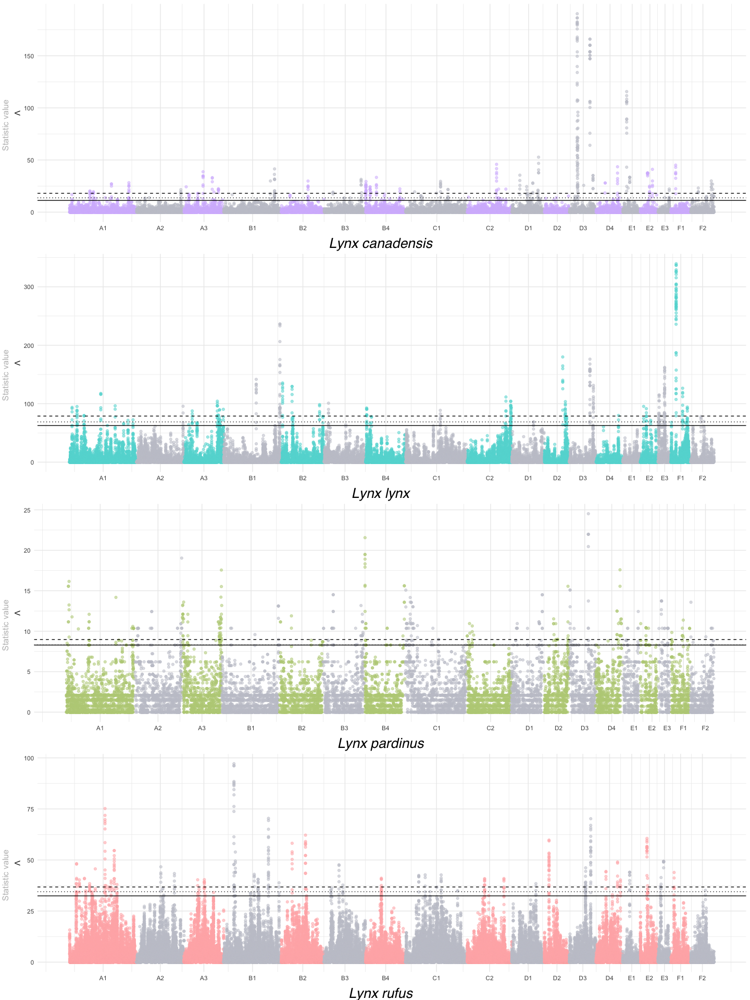
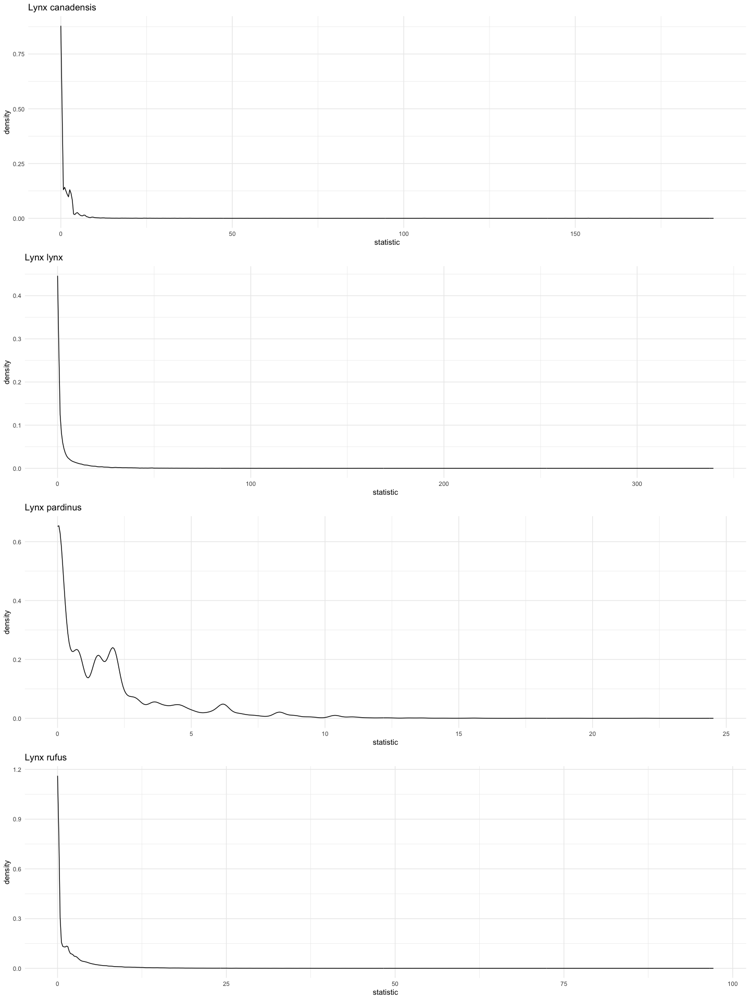

saltiLASSI-Positive selection genomic scan on lynxes
================
Lorena Lorenzo
07-Aug-2024

## SaltiLASSI results

In the graph, dashed, dotted and solid line corresponds to the top 300,
400 and 500 windows as outliers, respectively. The rest of the analyses
has been done with 500 windows as outliers.

<!-- --><!-- -->

## Candidate regions and genes

``` bash
module load bedtools

species=(lc ll lp lr)

for sp in ${species[@]}
  do
    echo "$sp"
       #merge every overlapping outlier window in LASSI 
       bedtools merge \
       -i ${sp}_lassi_500outliers.bed \
       -c 1 \
       -o count \
       > ${sp}_merged_tmp
       echo "$sp merged"
       
       #print a header (column names)
       echo -e "chr start end windows" | cat - ${sp}_merged_tmp | tr " " "\t" > ${sp}_candidate_regions
  
      #Extend candidate regions up and downstream 20kbp
      bedtools slop \
        -i  ${sp}_merged_tmp \
        -g chr_size.txt \
        -b 20000 \
        > ${sp}_extended_20kbp_tmp
        
      #print a header (column names)
       echo -e "chr start end windows" | cat - ${sp}_extended_20kbp_tmp | tr " " "\t" \
       > ${sp}_candidate_regions_extended_20kbp
       
  done  
  
  
  #Cross with annotation    
  for sp in ${species[@]}
  do    
     ###without extension 
        #1. Intersect with annotation file     
        bedtools intersect \
             -a ${sp}_candidate_regions \
             -b Felis_catus.Felis_catus_9.0.97.gff3 \
             -wa -wb \
             > ${sp}_candidate_regions_annotated 
            echo "$sp annotated"
        
        #2. Get only genes
          awk '$7=="gene"' ${sp}_candidate_regions_annotated  > ${sp}_genes_tmp
          echo "$sp genes"
        
        #3. Filter for interesting colums
           cut -f-1,2,3,4,7,8,9,13- ${sp}_genes_tmp | tr ' ' '\t' | cut -d';' -f1,2 | tr ';' '\t' | \
         awk '{if ($9 ~ /Name=[[:alnum:]]/) $9=$9; else $9="NA"; print $0}' | \
         awk '{if ($8 ~ /^ID=gene:/) {sub(/^ID=gene:/, "", $8)} if ($9 ~ /^Name=/) {sub(/^Name=/, "", $9)} print}' \
         > ${sp}_genes_filtered_tmp
      
        #4. Add a header
          echo -e "chr start end windows type gene_start gene_end ensembl_id gene_name" | \
          cat - ${sp}_genes_filtered_tmp > ${sp}_candidate_regions_genes
      
    ###with a 20kbp extension
        #1. Intersect with annotation file     
        bedtools intersect \
           -a ${sp}_candidate_regions_extended_20kbp \
           -b Felis_catus.Felis_catus_9.0.97.gff3 \
           -wa -wb \
           > ${sp}_candidate_regions_extended_20kbp_annotated 
          echo "$sp annotated"
          
        #2. Get only genes
          awk '$7=="gene"' ${sp}_candidate_regions_extended_20kbp_annotated   > ${sp}_genes_extend_tmp
          echo "$sp genes" 
      
        #3. Filter for interesting colums
          cut -f-1,2,3,4,7,8,9,13- ${sp}_genes_extend_tmp | tr ' ' '\t' | cut -d';' -f1,2 | tr ';' '\t' | \
            awk '{if ($9 ~ /Name=[[:alnum:]]/) $9=$9; else $9="NA"; print $0}' | \
            awk '{if ($8 ~ /^ID=gene:/) {sub(/^ID=gene:/, "", $8)} if ($9 ~ /^Name=/) {sub(/^Name=/, "", $9)} print}' \
            > ${sp}_genes_extend_filtered_tmp
      
        #4. Add a header
          echo -e "chr start end windows type gene_start gene_end ensembl_id gene_name" | \
          cat - ${sp}_genes_extend_filtered_tmp > ${sp}_candidate_regions_20kbp_genes
   
   done 
  
  #remove temporal files
  rm *tmp
```

## Enrichment analyses

``` r
##Dependencies
#BiocManager::install("biomaRt")
library(topGO)
library(biomaRt)

#####Get annotation from ensembl.org#####

#read from ensembl.org every felcat ensembl ID:
ensembl <- useMart("ensembl", dataset = "fcatus_gene_ensembl")  
###extract the GOterms for every ensembl_id
##ensembl_to_go <- getBM(attributes = c("ensembl_gene_id", "external_gene_name", "go_id"), ##mart = ensembl)

# Get attributes
attributes <- c("ensembl_gene_id", "external_gene_name", "go_id", "gene_biotype")

# Retrieve annotations
ensembl_to_go <- getBM(attributes = attributes, mart = ensembl) %>%
  filter(gene_biotype== "protein_coding")

#make a list with every GO terms per ENSEMBL_ ID. 
go_list <- split(ensembl_to_go$go_id, ensembl_to_go$ensembl_gene_id)

  #comment: Without filtering for coding genes, there is a total of 29550 ensembl_id corresponding to coding genes (19588) + non-coding genes (9468) + pseudogenes (494) according to https://www.ensembl.org/Felis_catus/Info/Annotation. We are getting 19564, 24 less than reported by the assembly (don't really know why)


for (sp in species)
{

#####read my gene data set#####  
    df_genes<- read.table(paste0(path, files, sp, "_candidate_regions_20kbp_genes"), 
                       sep=" ", header=T)
    genes <- df_genes %>%
              distinct(ensembl_id) %>%
              pull(ensembl_id) %>%
              as.character()  
    #this is a character object with the ensembl_ids ("ENSFCAG00000008235" "ENSFCAG00000008236" "ENSFCAG00000029529" ...)
    assign(paste0(sp, "_genes"), genes)

#cross the felcat annotation (ensembl_id with its GOterms) with my set of genes, to get a logical factor of true (if the gene is in the set) and false (if its not)
allgenes = factor(as.integer(names(go_list) %in% genes))
names(allgenes) <- names(go_list) #ensure names of allgenes are names of go_list (that is, the ensembl_id)

assign(paste0(sp, "_allgenes"), allgenes)

#create the empty results df before the loop
final_overrep <- data.frame()

for (gocat in c("BP", "MF", "CC"))
{
  
#####Creating the topGOdata object#####
godata <- new("topGOdata", ontology = gocat, allGenes = allgenes, 
              annotationFun = annFUN.gene2GO, gene2GO = go_list)

assign(paste0(sp, gocat, "_godata"), godata)
#####run the overrepresentation test#####
over_test <- runTest(godata, statistic = "fisher")

assign(paste0(sp, "_test"), over_test)

result_table <- GenTable(godata, Fisher=over_test, topNodes=over_test@geneData[2], numChar=1000) %>% 
        as_tibble() %>% 
        mutate(p.adj = round(p.adjust(as.numeric(gsub("<", "", Fisher)), method="BH"), 15), ontology= gocat) %>% 
        filter(p.adj<0.05 & Significant >1) 

final_overrep  <- rbind (final_overrep, result_table ) 

}

write.table(final_overrep, file=(paste0(path, files, sp, "_functional_enrichment.csv")), sep =  "\t", row.names = FALSE, quote = FALSE)
            
assign(paste0(sp, "_results"), final_overrep ) %>% mutate(species= names[sp])

}

#to print in the Rmd
knitr::kable(lc_results, caption= "Lynx canadensis")
```

| GO.ID        | Term                                                                   | Annotated | Significant | Expected | Fisher  |     p.adj | ontology |
|:-------------|:-----------------------------------------------------------------------|----------:|------------:|---------:|:--------|----------:|:---------|
| <GO:0050911> | detection of chemical stimulus involved in sensory perception of smell |       451 |          20 |     6.11 | 3.4e-06 | 0.0007004 | BP       |
| <GO:0004984> | olfactory receptor activity                                            |       687 |          30 |     9.18 | 9.8e-09 | 0.0000020 | MF       |
| <GO:0004930> | G protein-coupled receptor activity                                    |      1069 |          30 |    14.29 | 0.00013 | 0.0130650 | MF       |
| <GO:0038131> | neuregulin receptor activity                                           |         3 |           2 |     0.04 | 0.00053 | 0.0355100 | MF       |

Lynx canadensis

``` r
knitr::kable(ll_results, caption= "Lynx lynx")
```

| GO.ID        | Term                                                                           | Annotated | Significant | Expected | Fisher  |     p.adj | ontology |
|:-------------|:-------------------------------------------------------------------------------|----------:|------------:|---------:|:--------|----------:|:---------|
| <GO:0046415> | urate metabolic process                                                        |        12 |           2 |     0.08 | 0.0031  | 0.0241613 | BP       |
| <GO:0042733> | embryonic digit morphogenesis                                                  |        55 |           3 |     0.39 | 0.0068  | 0.0241613 | BP       |
| <GO:0021542> | dentate gyrus development                                                      |        19 |           2 |     0.13 | 0.0078  | 0.0241613 | BP       |
| <GO:0099645> | neurotransmitter receptor localization to postsynaptic specialization membrane |        21 |           2 |     0.15 | 0.0095  | 0.0241613 | BP       |
| <GO:0055002> | striated muscle cell development                                               |        45 |           2 |     0.32 | 0.0139  | 0.0241613 | BP       |
| <GO:1990823> | response to leukemia inhibitory factor                                         |        88 |           2 |     0.62 | 0.0140  | 0.0241613 | BP       |
| <GO:0071300> | cellular response to retinoic acid                                             |        31 |           2 |     0.22 | 0.0200  | 0.0288077 | BP       |
| <GO:0009056> | catabolic process                                                              |      1850 |          18 |    13.02 | 0.0201  | 0.0288077 | BP       |
| <GO:0021954> | central nervous system neuron development                                      |        71 |           3 |     0.50 | 0.0275  | 0.0298530 | BP       |
| <GO:0099590> | neurotransmitter receptor internalization                                      |        15 |           2 |     0.11 | 0.0276  | 0.0298530 | BP       |
| <GO:0001764> | neuron migration                                                               |       132 |           4 |     0.93 | 0.0313  | 0.0331594 | BP       |
| <GO:0048146> | positive regulation of fibroblast proliferation                                |        40 |           2 |     0.28 | 0.0322  | 0.0337784 | BP       |
| <GO:0030836> | positive regulation of actin filament depolymerization                         |         9 |           2 |     0.06 | 0.0344  | 0.0347000 | BP       |
| <GO:0003416> | endochondral bone growth                                                       |        21 |           2 |     0.15 | 0.0344  | 0.0347000 | BP       |
| <GO:0050811> | GABA receptor binding                                                          |         9 |           3 |     0.06 | 2.4e-05 | 0.0024240 | MF       |
| <GO:0008061> | chitin binding                                                                 |         7 |           2 |     0.05 | 0.00092 | 0.0464600 | MF       |

Lynx lynx

``` r
knitr::kable(lp_results, caption= "Lynx pardinus")
```

| GO.ID        | Term                              | Annotated | Significant | Expected | Fisher  |  p.adj | ontology |
|:-------------|:----------------------------------|----------:|------------:|---------:|:--------|-------:|:---------|
| <GO:0008506> | sucrose:proton symporter activity |         4 |           3 |     0.12 | 0.00010 | 0.0447 | MF       |

Lynx pardinus

``` r
knitr::kable(lr_results, caption= "Lynx rufus")
```

| GO.ID        | Term                                                             | Annotated | Significant | Expected | Fisher  |     p.adj | ontology |
|:-------------|:-----------------------------------------------------------------|----------:|------------:|---------:|:--------|----------:|:---------|
| <GO:0070836> | caveola assembly                                                 |         4 |           2 |     0.02 | 0.00010 | 0.0064000 | BP       |
| <GO:0031398> | positive regulation of protein ubiquitination                    |        74 |           4 |     0.31 | 0.00026 | 0.0083200 | BP       |
| <GO:1905719> | protein localization to perinuclear region of cytoplasm          |         9 |           2 |     0.04 | 0.00062 | 0.0124800 | BP       |
| <GO:0007032> | endosome organization                                            |        43 |           3 |     0.18 | 0.00078 | 0.0124800 | BP       |
| <GO:0032570> | response to progesterone                                         |        12 |           2 |     0.05 | 0.00112 | 0.0134720 | BP       |
| <GO:0006936> | muscle contraction                                               |       200 |           3 |     0.84 | 0.00283 | 0.0134720 | BP       |
| <GO:0097150> | neuronal stem cell population maintenance                        |        22 |           2 |     0.09 | 0.00382 | 0.0134720 | BP       |
| <GO:0071711> | basement membrane organization                                   |        27 |           2 |     0.11 | 0.00573 | 0.0174629 | BP       |
| <GO:0001541> | ovarian follicle development                                     |        41 |           2 |     0.17 | 0.01288 | 0.0211364 | BP       |
| <GO:1903078> | positive regulation of protein localization to plasma membrane   |        48 |           2 |     0.20 | 0.01739 | 0.0212114 | BP       |
| <GO:0031397> | negative regulation of protein ubiquitination                    |        49 |           2 |     0.21 | 0.01808 | 0.0212114 | BP       |
| <GO:0043122> | regulation of canonical NF-kappaB signal transduction            |       171 |           3 |     0.72 | 0.01851 | 0.0212114 | BP       |
| <GO:0043276> | anoikis                                                          |        21 |           2 |     0.09 | 0.02058 | 0.0212114 | BP       |
| <GO:0051224> | negative regulation of protein transport                         |        77 |           3 |     0.32 | 0.02435 | 0.0243500 | BP       |
| <GO:0140036> | ubiquitin-dependent protein binding                              |        17 |           2 |     0.07 | 0.0023  | 0.0473043 | MF       |
| <GO:0022848> | acetylcholine-gated monoatomic cation-selective channel activity |        19 |           2 |     0.08 | 0.0029  | 0.0473043 | MF       |
| <GO:0120017> | ceramide transfer activity                                       |         7 |           2 |     0.03 | 0.0125  | 0.0473043 | MF       |
| <GO:0030145> | manganese ion binding                                            |        47 |           2 |     0.20 | 0.0170  | 0.0473043 | MF       |

Lynx rufus
